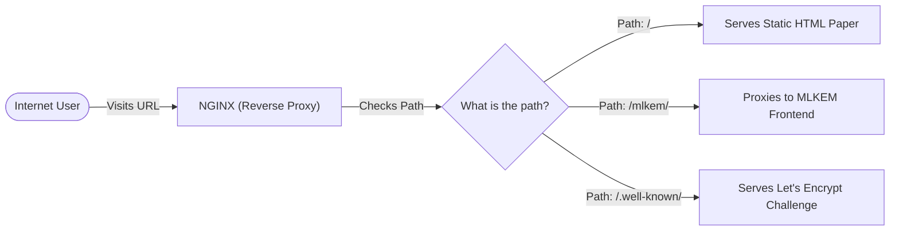
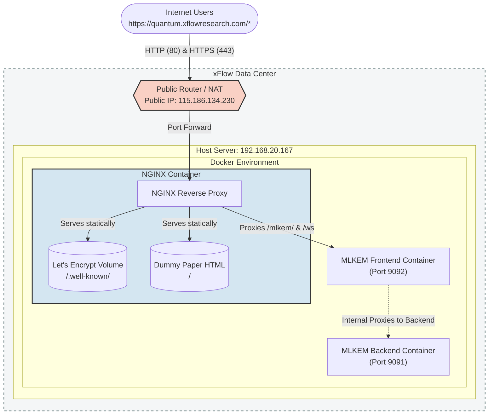
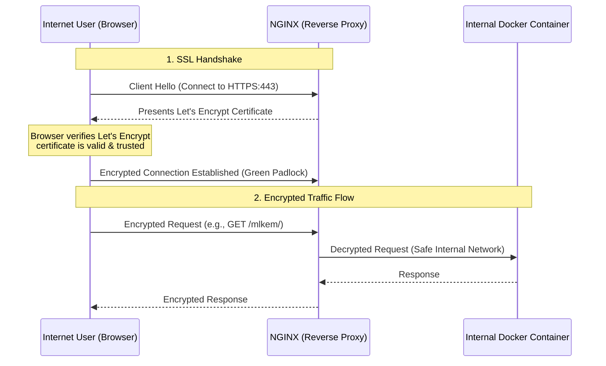
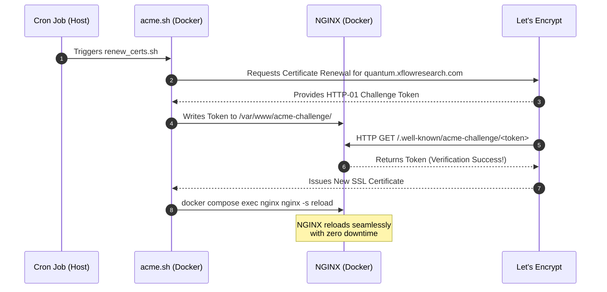

# Quantum Team Website Configuration

This repository contains the configuration for the Quantum Team's public-facing web infrastructure, securely hosting the MLKEM web app and static research papers. 

This documentation is designed to help future developers easily understand, maintain, and expand the setup.

---

## Repository Structure

To help you seamlessly navigate the configuration, here is the physical layout of this repository on the Host Server (`/home/xflow/quantum-team/quantum-website-conf/`):

```text
quantum-website-conf/
├── NGINX/
│   ├── docker-compose.yml   # Orchestrates the NGINX Reverse Proxy
│   ├── nginx.conf           # The routing rules and SSL configuration
│   └── renew_certs.sh       # Zero-downtime Let's Encrypt renewal script
└── mlkem-webapp/
    ├── docker-compose.yml   # Orchestrates the MLKEM application
    ├── frontend/            # React/Vite Frontend source code
    └── backend/             # Go Backend source code
```

---

## What It Is

Our infrastructure relies on three core technologies working perfectly in sync:

1. **Docker:** A containerization platform. Instead of installing applications directly on the host server, we package our frontend, backend, and proxies into isolated "containers." This guarantees that the applications run exactly the same way everywhere, making deployments predictable and safe.
2. **NGINX:** A high-performance web server acting as a **Reverse Proxy**. It sits at the absolute front door of our server environment. Its job is to listen for incoming web traffic and act as a "traffic cop," routing different URLs to different Docker containers, so we only need to expose one port to the public.
3. **Let's Encrypt:** A free, automated certificate authority. We use it to automatically generate and renew the SSL certificates that give our website the secure `https://` green padlock, ensuring all user data is encrypted.

---

## How It Works

When an internet user accesses `https://quantum.xflowresearch.com`, the traffic hits our public router, which forwards it to the NGINX container. NGINX decrypts the secure traffic and looks at the URL path to decide which internal Docker container should handle the request.

### Request Lifecycle



### Complete Architecture Diagram

This diagram maps out exactly where the containers live physically and how they communicate.



---

## Technical Details

The infrastructure relies on Docker Compose to orchestrate the NGINX proxy and the individual application containers.

### 1. SSL and Let's Encrypt (Zero-Downtime)

Let's Encrypt is a globally trusted Certificate Authority. Once NGINX has the certificate, Let's Encrypt is *not* actively involved in every user connection; instead, the user's browser simply trusts the certificate NGINX presents.

#### Secure Connection Flow (How it works for Users)



**How the Browser Verifies the Certificate:**
1. **Root of Trust**: Every modern browser (Chrome, Edge, Safari) comes pre-installed with a secure list of trusted "Root Certificate Authorities", which includes Let's Encrypt (ISRG Root X1).
2. **Digital Signature**: The certificate presented by NGINX contains a cryptographic signature from Let's Encrypt.
3. **Validation**: The browser checks its pre-installed Root CA list to verify that the signature is mathematically valid. It also checks that the certificate has not expired and that it strictly matches the domain `quantum.xflowresearch.com`.
4. **Result**: Because the browser already inherently trusts Let's Encrypt, it trusts the signature, establishes the encrypted tunnel, and displays the "Secure" green padlock—all without needing to communicate with Let's Encrypt servers during the connection.

- **Port 80 (HTTP)** is deliberately kept open for two reasons:
  1. To automatically redirect insecure traffic to Port 443 (HTTPS).
  2. To serve Let's Encrypt HTTP-01 challenges from the `/var/www/acme-challenge` directory.
- **Certificate Renewal:** A script named `renew_certs.sh` is provided in the `NGINX/` directory. It uses the `acme.sh` Docker image in "webroot" mode to seamlessly renew certificates via Port 80 without requiring NGINX to stop, ensuring 100% uptime.

#### SSL & Let's Encrypt Renewal Flow

This process is automated via the `renew_certs.sh` script. To ensure the certificates never expire, this script should be scheduled to run automatically on the **Host Server** (not inside a container) via a cron job.

To configure this, log into the host server (`192.168.20.167`) and edit the crontab:
```bash
crontab -e
```
Add the following line to run the renewal script on the 1st of every month at midnight:
```bash
0 0 1 * * /home/xflow/quantum-team/quantum-website-conf/NGINX/renew_certs.sh >> /var/log/ssl_renewal.log 2>&1
```
*(The script is smart enough to only renew the certificate if Let's Encrypt determines it is within 30 days of expiring, otherwise it gracefully exits without doing anything).*



### 2. NGINX Routing (`nginx.conf`)
NGINX routes requests based on location blocks:
- `/`: Serves static HTML (the dummy research paper) directly from the NGINX container's file system at the root path.
- `/mlkem/`: Proxies traffic to the MLKEM Frontend React application.
- `/ws`: Explicitly proxies WebSocket connections necessary for the MLKEM frontend to communicate with the backend. It uses HTTP `Upgrade` headers to keep the WebSocket connection alive.
- **Networking:** NGINX uses `host.docker.internal` to route traffic to the application containers (which have their specific internal ports exposed, e.g., `9092` for the frontend).

---

## Scalability: How to Add a New Application

When the team develops a new application (e.g., a new quantum simulation tool), developers can easily expose it securely to the public through the existing NGINX proxy by following these steps:

### Step 1: Run the New Application
Deploy your new application using Docker. Ensure it exposes a unique internal port on the host machine.
*Example: The new app exposes port `9094`.*

### Step 2: Update NGINX Configuration
Open `NGINX/nginx.conf` and add a new `location` block inside the `server { listen 443 ssl; ... }` block to route a specific URL path to your new app's port.

```nginx
        # New Application Route
        location /new-app/ {
            proxy_pass http://host.docker.internal:9094/;
            proxy_http_version 1.1;
            proxy_set_header Upgrade $http_upgrade;
            proxy_set_header Connection "upgrade";
            proxy_set_header Host $host;
        }
```
*(Note: Be mindful of trailing slashes in `location` and `proxy_pass` as they affect how NGINX rewrites the URL before passing it to the container).*

### Step 3: Rebuild and Restart NGINX
Because the `nginx.conf` file is baked into the NGINX Docker image via the `Dockerfile`, you **must** rebuild the NGINX image to apply the changes.

Navigate to the NGINX directory and run:
```bash
docker compose up -d --build
```
This will seamlessly recreate the NGINX container with the new routing configuration while keeping your SSL certificates completely intact.
