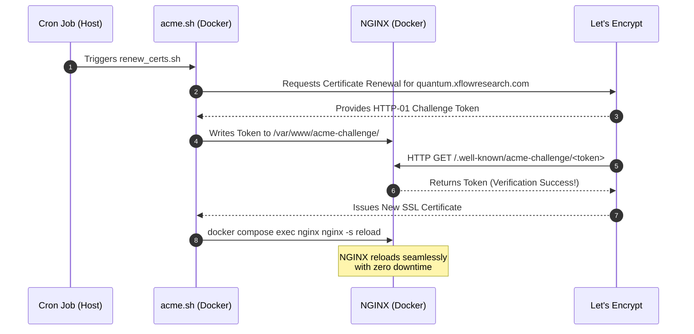

# Quantum Team Website Configuration

This repository contains the configuration for the Quantum Team's public-facing web infrastructure, including the NGINX reverse proxy, SSL certificate management, and the routing configuration for various applications such as the MLKEM web app.

## High-Level Architecture

At a high level, the system consists of a single public-facing NGINX container that acts as a reverse proxy. It intercepts all incoming HTTP and HTTPS traffic from the internet, handles secure SSL termination using Let's Encrypt certificates, and intelligently routes requests to various internal Docker containers based on the requested URL path. 

This architecture allows multiple independent applications to be hosted securely on the same domain (`quantum.xflowresearch.com`) without exposing their internal ports directly to the internet.

### Architecture Diagram


## Technical Explanation

The infrastructure relies on Docker Compose to orchestrate the NGINX proxy and the individual application containers.

### 1. SSL and Let's Encrypt (Zero-Downtime)
- **Port 80 (HTTP)** is open specifically for two reasons:
  1. To automatically redirect insecure traffic to Port 443 (HTTPS).
  2. To serve Let's Encrypt HTTP-01 challenges from the `/var/www/acme-challenge` directory.
- **Certificate Renewal:** A script named `renew_certs.sh` is provided in the `NGINX/` directory. It uses the `acme.sh` Docker image in "webroot" mode to seamlessly renew certificates via Port 80 without requiring NGINX to stop, ensuring 100% uptime.

#### SSL & Let's Encrypt Renewal Flow

This process is automated via the `renew_certs.sh` script, which can be run periodically (e.g., via a monthly cron job).



### 2. NGINX Routing (`nginx.conf`)
NGINX routes requests based on location blocks:
- `/`: Serves static HTML (the dummy research paper) directly from the NGINX container's file system at the root path.
- `/mlkem/`: Proxies traffic to the MLKEM Frontend React application.
- `/ws`: Explicitly proxies WebSocket connections necessary for the MLKEM frontend to communicate with the backend. It uses HTTP `Upgrade` headers to keep the WebSocket connection alive.
- **Networking:** NGINX uses `host.docker.internal` to route traffic to the application containers (which have their specific internal ports exposed, e.g., `9092` for the frontend).

## Scalability: How to Add a New Application

When the team develops a new application (e.g., a new quantum simulation tool), follow these steps to expose it securely to the public through the existing NGINX proxy:

### Step 1: Run the New Application
Deploy your new application using Docker. Ensure it exposes a unique internal port on the host machine.
*Example: The new app exposes port `9093`.*

### Step 2: Update NGINX Configuration
Open `NGINX/nginx.conf` and add a new `location` block inside the `server { listen 443 ssl; ... }` block to route a specific URL path to your new app's port.

```nginx
        # New Application Route
        location /new-app/ {
            proxy_pass http://host.docker.internal:9093/;
            proxy_http_version 1.1;
            proxy_set_header Upgrade $http_upgrade;
            proxy_set_header Connection "upgrade";
            proxy_set_header Host $host;
        }
```
*(Note: Be mindful of trailing slashes in `location` and `proxy_pass` as they affect how NGINX rewrites the URL before passing it to the container).*

### Step 3: Rebuild and Restart NGINX
Because the `nginx.conf` file is baked into the NGINX Docker image via the `Dockerfile`, you **must** rebuild the NGINX image to apply the changes.

Navigate to the NGINX directory and run:
```bash
docker compose up -d --build
```
This will seamlessly recreate the NGINX container with the new routing configuration while keeping your SSL certificates completely intact.
